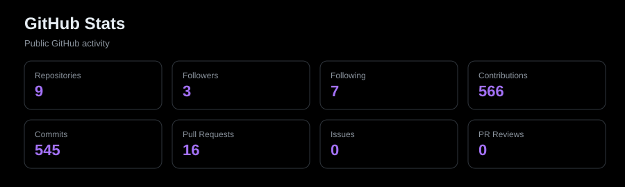
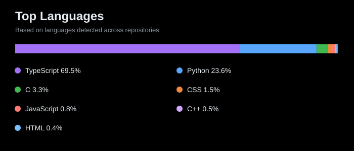
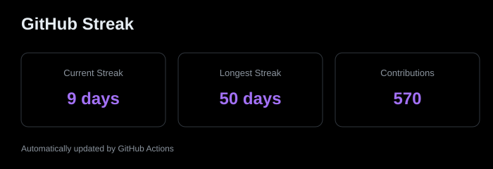

<h1 align="center">Hi 👋, I'm Harsha Vardhan Katuri</h1>

  

  

  

  

# 💫 About Me

I'm a dedicated **Embedded/Firmware Engineer** with around **1.8 years of experience** specializing in developing robust firmware and application middleware for embedded systems. My expertise spans sensor interfacing, communication protocols, embedded Linux, POSIX threads, register-level programming, signal processing, and embedded C/C++ development.

### 🚀 What I'm Currently Working On

- Firmware development and bug fixing for current company embedded products

- Embedded Linux firmware and application middleware development

- Multithreaded applications using POSIX threads

- **SpO₂ Respiratory Rate:** Processing waveform data received from the **SpO₂ (pulse oximetry) module** to calculate **Respiratory Rate (RR)** in **breaths per minute**.

- **ECG Signal Processing & Live Graph:** Working on **ECG signal-strength handling and introduction delay** to stabilize the ECG waveform, analyzing raw ECG module data in **MATLAB** to validate the application graph, and integrating **live ECG graph generation**.

- **Bluetooth Module Migration:** Migrating the existing Bluetooth implementation from **BT122 to BM78**, including the required firmware communication and module-integration changes.

- Sensor integration and communication protocols

- Hardware-firmware integration, board bring-up, and debugging

### 🤝 Collaboration Interests

- Embedded firmware and embedded Linux projects

- IoT and sensor-based embedded systems

- BLE / LoRa communication projects

- Hardware-firmware integration

- Signal acquisition, processing, and visualization

- Low-level firmware and protocol development

### 🌱 Currently Learning

- Advanced BLE protocols and Bluetooth module integration

- Linux and Embedded Linux systems

- RTOS / FreeRTOS

- Linux Device Drivers

- Embedded signal processing

- Real-time data acquisition and visualization

- Docker for embedded applications

- Scalable IoT architectures

### 💬 Ask Me About

- Embedded C/C++, ESP32/ESP8266, Arduino, LPC2148

- Embedded Linux, POSIX Threads, Multithreading

- UART, SPI, I2C, RS485, Modbus RTU, USB, TCP/IP, Ethernet, Wi-Fi

- BLE, Bluetooth module integration, and LoRa communication

- SpO₂ waveform data and Respiratory Rate calculation

- ECG raw-data analysis, MATLAB waveform plotting, and live graph integration

- Sensor integration, firmware debugging, board bring-up, and protocol analysis

### ⚡ Fun Fact

I enjoy turning raw sensor data and hardware signals into reliable real-world solutions through efficient firmware design.

---

*"Code is poetry written in logic, and firmware is the heartbeat of innovation."*

---

## 🚀 Featured Projects

### 🌐 **[My Portfolio Website](https://k-harsha-v-portfolio.lovable.app)**

A showcase of my embedded engineering projects, including IoT solutions and firmware developments.

*(Check my repositories for detailed code implementations)*

### 📊 GitHub Activity

<!--START_SECTION:activity-->

<!--END_SECTION:activity-->

*(Activity updates automatically)*

## 🛠️ Skills & Technologies

| Category | Technologies |
|----------|-------------|
| **Programming Languages** |    |
| **Embedded Systems & IoT** |   |
| **Tools & Technologies** |      |
| **Web Technologies** |   |

## 🎓 Education

- **Bachelor of Technology in Electronics and Communication Engineering**

  Jawaharlal Nehru Technological University, Hyderabad (2019-2023)

  *Relevant Coursework: Embedded Systems, Digital Electronics, Microcontrollers, IoT, Signal Processing*

## 🏆 Key Achievements

- Secured a 91% in the JEE Mains exam, outperforming thousands of candidates, and ranked as the top student in Intermediate, showcasing the ability to solve complex problems and deliver effective solutions.

## 📜 Certifications

- AI Internship Certification by Edunet Foundation- [Link](https://drive.google.com/file/d/1UpvhADPt5PcDh8cPJHmpB-EW0ofB0OtL/view?usp=drive_link)

- Advanced Embedded Systems Certification by Vector India - [Link](https://drive.google.com/file/d/1SYoyuzSusxvReLb4P6XKZbM8zdqWSdhv/view?usp=drive_link)

- Linux Device Drivers Certification - [Link](https://drive.google.com/file/d/1gkV6Pg4lFr8y9v-sqgLuZAUI6pbLSU66/view?usp=drive_link)

## 🌐 Connect with me:

I'm always open to discussing innovative embedded solutions, IoT projects, or potential collaborations. Feel free to reach out!

&nbsp;&nbsp;&nbsp;

&nbsp;&nbsp;&nbsp;

&nbsp;&nbsp;&nbsp;

---

## 🎯 Fun Facts

- ☕ Fueled by coffee and curiosity

- 🔧 I can debug code faster than I can debug my sleep schedule

- 🌟 Turning "impossible" into "I'm possible" one line of code at a time

---

# 📊 GitHub Stats:

<table align="center" border="0" cellspacing="0" cellpadding="0" style="border: none; background: transparent;">

  <tr>

    <td align="center" style="border: none; background: transparent; padding: 0;">

      

    </td>

    <td align="center" style="border: none; background: transparent; padding: 0;">

      

    </td>

  </tr>

  <tr>

    <td colspan="2" align="center" style="border: none; background: transparent; padding: 0;">

      

    </td>

  </tr>

</table>